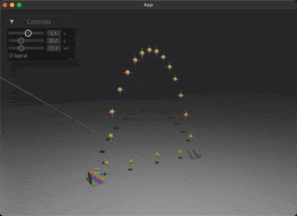

# bevy_ballistic

[![crates.io][sh_crates]][lk_crates]
[![docs.rs][sh_docs]][lk_docs]
[![discord][sh_discord]][lk_discord]

[sh_crates]: https://img.shields.io/crates/v/bevy_ballistic.svg
[lk_crates]: https://crates.io/crates/bevy_ballistic
[sh_docs]: https://img.shields.io/docsrs/bevy_ballistic
[lk_docs]: https://docs.rs/bevy_ballistic/latest/bevy_ballistic/
[sh_discord]: https://img.shields.io/discord/1176858176897953872?label=discord&color=5561E6
[lk_discord]: https://discord.gg/rQNeEnMhus



Simple launch velocity calculation for game projectiles to hit a specified target based on given gravity. Only depending on `bevy_math` for vector math.
Based on this [article](https://www.forrestthewoods.com/blog/solving_ballistic_trajectories/) by Forrest Smith

## How to run example

```
cargo r --example bevy
```

## Our Other Crates

- [bevy_debug_log](https://github.com/rustunit/bevy_debug_log)
- [bevy_device_lang](https://github.com/rustunit/bevy_device_lang)
- [bevy_web_popups](https://github.com/rustunit/bevy_web_popups)
- [bevy_libgdx_atlas](https://github.com/rustunit/bevy_libgdx_atlas)
- [bevy_ios_review](https://github.com/rustunit/bevy_ios_review)
- [bevy_ios_gamecenter](https://github.com/rustunit/bevy_ios_gamecenter)
- [bevy_ios_alerts](https://github.com/rustunit/bevy_ios_alerts)
- [bevy_ios_notifications](https://github.com/rustunit/bevy_ios_notifications)
- [bevy_ios_impact](https://github.com/rustunit/bevy_ios_impact)
- [bevy_ios_safearea](https://github.com/rustunit/bevy_ios_safearea)
- [bevy_ios_iap](https://github.com/rustunit/bevy_ios_iap)

## Bevy version support

|bevy|crate|
|---|---|
|0.17|0.5,main|
|0.16|0.3-0.4|
|0.15|0.1-0.2|

# License

All code in this repository is dual-licensed under either:

- MIT License (LICENSE-MIT or http://opensource.org/licenses/MIT)
- Apache License, Version 2.0 (LICENSE-APACHE or http://www.apache.org/licenses/LICENSE-2.0)

at your option. This means you can select the license you prefer.

## Your contributions
Unless you explicitly state otherwise, any contribution intentionally submitted for inclusion in the work by you, as defined in the Apache-2.0 license, shall be dual licensed as above, without any additional terms or conditions.
